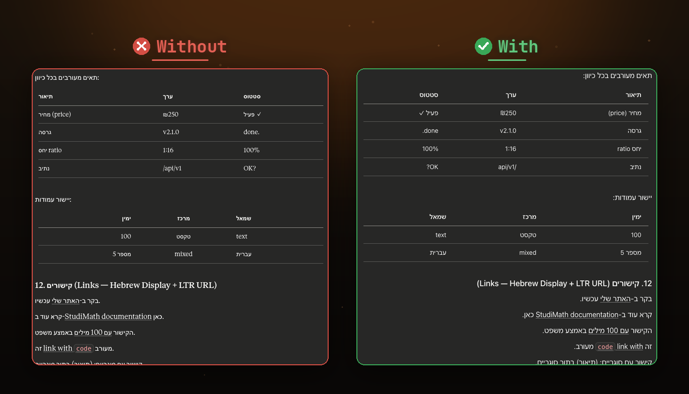
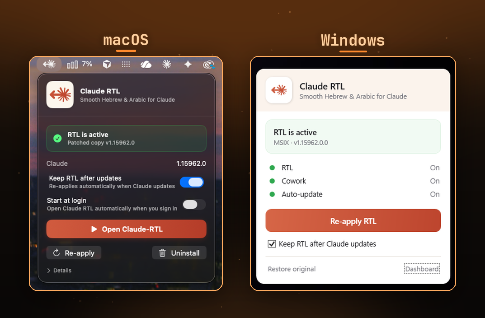

<p align="center">
  
</p>

<p align="center">
  
  &nbsp;
  <a href="docs/README.he.md"></a>
  &nbsp;
  <a href="docs/README.ar.md"></a>
</p>

<p align="center">
  <i>Smooth right-to-left (Hebrew · Arabic · Persian) for <b>Claude Desktop</b> &amp; <b>claude.ai</b> — from one pure engine.</i>
</p>

<p align="center">
  <a href="https://github.com/liorshaya/claude-desktop-rtl/releases/latest"></a>
  
  
  
  
  
</p>

---

**Claude RTL makes Hebrew, Arabic and Persian render correctly — right-to-left — everywhere Claude runs, without ever touching your text or your network.** Out of the box, Claude writes beautiful Hebrew and then displays it left-to-right: bullets on the wrong side, punctuation jumping across the line, tables flowing backwards.

<p align="center">
  
</p>

<p align="center">
  <sub><b>Without</b> Claude RTL the reply renders left-to-right — reversed table columns, punctuation on the wrong side. <b>With</b> it, every block reads correctly.</sub>
</p>

## Why it matters

- 🎯 **Per-block direction, done right.** Each paragraph, list, table and quote decides its *own* direction from its *own* content. English blocks stay LTR and Hebrew blocks flip RTL — **in the same document**, with no global flip (the bug every other tool has).
- 🔒 **Zero network. Zero telemetry. Zero stored data.** Your conversations never leave your machine. Copy and Ctrl-F stay **byte-for-byte** — no invisible Unicode marks are ever injected.
- 🛡️ **Safe by construction.** On macOS your original Claude is **never modified** (a separate patched copy is built); on Windows the originals are **backed up first** and one click restores them.
- 🖥️ **Desktop *and* browser, one engine.** A menu-bar app on macOS, a tray app on Windows, and a userscript for claude.ai in any browser — all sharing the exact same bidi engine.
- 🧪 **A pure, unit-tested core.** The bidi intelligence (`engine/`) is DOM-free and covered by a torture-test corpus, decoupled from how it's delivered.

## ✅ Supported platforms

| Platform | Requirements |
|---|---|
| 🍎 **macOS Desktop** | macOS 13 (Ventura) or later. The prebuilt `.dmg` is for Apple Silicon; Intel Macs build from source. |
| 🪟 **Windows Desktop — claude.ai installer** | Windows 10 / 11 (64-bit), Claude installed from claude.ai (the classic `.exe`). |
| 🏪 **Windows Desktop — Microsoft Store** | Windows 10 / 11 (64-bit), Claude installed from the Microsoft Store (MSIX). One-time admin approval. |
| 🌐 **Browser — claude.ai** | Any OS. Chrome, Edge, Firefox or Safari with a userscript manager. |

## 🚀 Install

<p align="center">
  
</p>

<p align="center">
  <sub>The one-click manager on <b>macOS</b> (menu bar) and <b>Windows</b> (tray) — installs, auto-updates and removes RTL, no terminal needed.</sub>
</p>

### 🍎 macOS

1. Download the **`.dmg`** from the [latest release](https://github.com/liorshaya/claude-desktop-rtl/releases/latest) and drag **Claude RTL** onto **Applications**.
2. *First launch only:* right-click the app → **Open** → **Open** *(macOS Sequoia: System Settings → Privacy & Security → “Open Anyway”)*. One-time, because the app is ad-hoc signed, not Apple-notarized.
3. Click **Install RTL**. macOS asks for your keychain password once → **Always Allow**.
4. Click **Open Claude-RTL**.

**Command line** (equivalent, or to build the app yourself — needs Node + Xcode CLT):

```bash
git clone https://github.com/liorshaya/claude-desktop-rtl.git
cd claude-desktop-rtl
desktop/patch.sh --install     # builds a patched copy at ~/Applications/Claude-RTL.app
desktop/patch.sh --status      # verify
# GUI app instead: cd gui && ./build.sh && open "dist/Claude RTL.app"
```

**✔ Expected result:** the app badge reads **“RTL is active”**, and `--status` prints `patched  : ~/Applications/Claude-RTL.app (v…) — installed`. The original Claude in `/Applications` is never touched.

### 🪟 Windows — installed from claude.ai

1. Download **`ClaudeRTL-Setup-…-win-x64.exe`** from the [latest release](https://github.com/liorshaya/claude-desktop-rtl/releases/latest) and run it — a **per-user** install, no admin, nothing to install first (a portable runtime is bundled).
2. Launch **Claude RTL** from the Start menu and click **Install RTL**. Originals are backed up to `*.crtl-bak` first.
3. Open Claude.

**Command line** (equivalent — needs Node when run from a git checkout):

```powershell
git clone https://github.com/liorshaya/claude-desktop-rtl.git
cd claude-desktop-rtl
powershell -ExecutionPolicy Bypass -File .\desktop\windows\preflight.ps1   # readiness check (read-only)
powershell -ExecutionPolicy Bypass -File .\desktop\windows\patch.ps1       # apply RTL in place
powershell -ExecutionPolicy Bypass -File .\desktop\windows\patch.ps1 -Status
```

**✔ Expected result:** the tray badge reads **“RTL is active”**, and `-Status` prints `patched : True  (payload marker in app.asar)`.

### 🏪 Windows — Microsoft Store (MSIX)

1. Same installer and tray app as above — it **auto-detects** the Store install.
2. Click **Install RTL** and approve the one-time **admin prompt** (UAC). It re-signs Claude with a local certificate so **Cowork keeps working**; **Restore original** fully reverts everything.
3. Open Claude.

**Command line** (equivalent — run from an **elevated** PowerShell, needs Node from a git checkout):

```powershell
powershell -ExecutionPolicy Bypass -File .\desktop\windows\patch-msix.ps1          # apply (admin)
powershell -ExecutionPolicy Bypass -File .\desktop\windows\patch-msix.ps1 -Verify  # read-only check
```

**✔ Expected result:** `-Verify` prints `RTL injected (asar marker)   : True` and confirms the certificate lines — and Cowork still works.

### 🌐 Browser — claude.ai (any OS)

1. Install **Tampermonkey** (or Violentmonkey) and enable **“Allow User Scripts”** in the extension (a Chrome/Edge requirement).
2. Build the userscript (needs Node):

```bash
git clone https://github.com/liorshaya/claude-desktop-rtl.git
cd claude-desktop-rtl
npm run build            # builds dist/claude-rtl.user.js
```

3. Open `dist/claude-rtl.user.js` and install it (or paste its contents into a new Tampermonkey script).
4. Reload `claude.ai`.

**✔ Expected result:** Hebrew and Arabic replies on claude.ai immediately read right-to-left — including inside the Artifacts panel.

## 🧰 Everything else

<details>
<summary><b>📋 What it handles</b> — the full surface list</summary>

| Surface | Behaviour |
|---|---|
| Prose (paragraphs, headings) | Per-block base direction via the browser's own first-strong |
| Lists (incl. nested) | Markers + indent hang on the content side; smart per-item direction |
| Tables | Column order follows the content majority; every column aligns to its own language |
| Block quotes | The bar/indent move to the content side |
| Numbers, currency, %, dates | Ordered correctly; never force a Hebrew line LTR |
| Comparisons (`3 < 5`) & signed numbers (`-5`) | Isolated so the math never reads backwards |
| Arrows (`→`) in RTL | Mirrored visually — the character itself is untouched |
| Code blocks | Stay **LTR** by design (RTL would scramble syntax) |
| Input / edit boxes | `dir="auto"`, instantly, with no flicker |
| Mixed English/Hebrew doc | Each block self-determines — no global flip |

</details>

<details>
<summary><b>🔁 Keep RTL after Claude updates</b> — the auto-re-apply watcher</summary>

Claude updates replace its files, wiping any patch. Toggle **“Keep RTL after Claude updates”** in the app (both OSes) and RTL re-applies itself automatically after every update — it waits for the update to fully settle first, and never force-kills a running Claude.

Command line: `desktop/patch.sh --watch` / `--unwatch` (macOS, a user-scope LaunchAgent), `patch.ps1 -Watch` / `-Unwatch` (Windows claude.ai install, a logon watcher), `patch-msix.ps1 -Watch` / `-Unwatch` (Store install, a scheduled task).

</details>

<details>
<summary><b>🧹 Uninstall / restore</b> — one command, fully reversible</summary>

- **macOS:** click **Uninstall** in the app, or `desktop/patch.sh --uninstall` — removes `~/Applications/Claude-RTL.app`; the original was never modified.
- **Windows (claude.ai install):** click **Restore original** in the app, or `patch.ps1 -Restore` — puts the backed-up `claude.exe` + `app.asar` back, byte-for-byte.
- **Windows (Store):** **Restore original**, or `patch-msix.ps1 -Restore` — also removes the local certificate it created.
- **Browser:** remove the script from Tampermonkey.

</details>

<details>
<summary><b>🛠 Troubleshooting</b></summary>

- **macOS won't open the app** (“unidentified developer”): right-click → **Open** → **Open**, or System Settings → Privacy & Security → **Open Anyway**. One-time; building from source skips it.
- **Blank first window** after patching (macOS): quit (⌘Q) and reopen — a one-time effect.
- **Keychain prompt** (macOS): click **Always Allow** — the patched copy re-reads the same local keychain entry Claude already uses.
- **“Open Claude-RTL” quits the original first** — they share a user-data dir and can't run together.
- **Userscript does nothing** (Chrome/Edge): enable **“Allow User Scripts”** for Tampermonkey, then reload claude.ai.
- **Windows says the install is in use:** close Claude first, or let the watcher apply RTL the next time Claude is closed.

</details>

<details>
<summary><b>🧠 How it works</b> — 30 seconds of internals</summary>

The browser already runs a complete Unicode Bidi Algorithm. Claude RTL doesn't reimplement it — it makes the **direction & isolation decisions** and lets the renderer reorder. CSS `unicode-bidi: plaintext` per leaf block is the sole base-direction mechanism for prose, so every block self-determines and the container is never force-flipped. The desktop apps inject the same engine into Claude's renderer bundles and flip only the window-chrome direction in the main process.

Full design: **[ARCHITECTURE.md](docs/ARCHITECTURE.md)** · Windows pipeline: **[docs/WINDOWS.md](docs/WINDOWS.md)**

</details>

<details>
<summary><b>⚠️ Limitations (v1)</b></summary>

- **Real code blocks stay LTR** (deliberate — RTL scrambles braces, indentation, operators). A fence that is actually Hebrew prose *is* detected and rendered RTL.
- **Desktop Artifacts** render in a cross-origin iframe the desktop payload can't enter yet (the browser userscript does cover them).
- **No bundled Hebrew font yet** — macOS already renders Hebrew via system fonts.
- Full list: **[ARCHITECTURE.md §15](docs/ARCHITECTURE.md)**.

</details>

## 🤝 Contributing

PRs are very welcome — the engine is pure and unit-tested; the bar is a green `node --test` and a small, single-purpose change. Start with **[CONTRIBUTING.md](CONTRIBUTING.md)**; if Claude changes its DOM, the **[adopt-a-new-Claude-version runbook](docs/RUNBOOK-adopt-new-claude-version.md)** shows exactly how to update the selectors.

## 📄 License

[MIT](LICENSE) © Lior Shaya
